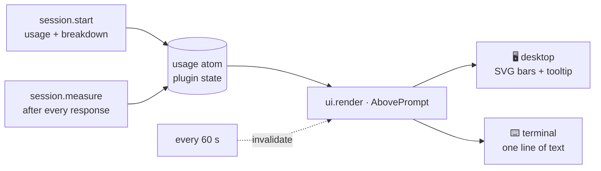

<div align="center">

# 📶 usage-band

[](https://github.com/zexion7873/usage-band/actions/workflows/check.yml)


**Context fill and every rate-limit window, always on, right above the Claude
Code prompt — in the desktop app's Code tab as well as the terminal.**

[](LICENSE)
[](#%EF%B8%8F-desktop-and-terminal)
[](#-how-it-works)

No status-line script. No network requests. No model calls. One mod reading
Claude Code's own session usage.

</div>

---

## 🚀 Install

### 🤖 Hand it to your agent

Paste this and walk away:

```text
Fetch and follow https://raw.githubusercontent.com/zexion7873/usage-band/main/llms-install.md
```

It installs from the CLI and verifies the install. Recipe in
[llms-install.md](llms-install.md).

### 🧑 Or type it yourself

From inside a Claude Code terminal session:

```text
/plugin marketplace add zexion7873/usage-band
/plugin install usage-band@usage-band
```

Pick the user scope. The band appears in that session at once. Installed at the
user scope, it also loads in sessions the desktop app starts — the desktop Code
tab cannot run `/plugin` itself, so install from a terminal once.

> [!IMPORTANT]
> **Requirements:** a Claude Code build with function-hook plugins (mods). CI
> validates and tests against Claude Code 2.1.291; older builds are unmeasured.

---

## 📊 What it shows

|   | Item | Meaning |
|:-:|------|---------|
| 🧠 | **`ctx`** | Context window fill, `tokens/window` beside it. A red tick marks where auto-compact triggers. |
| ⏱️ | **`5h`**, **`wk`** | Each rate-limit window: percent used and time until it resets. A grey tick marks the share of the window already elapsed — a fill past the tick is burning faster than an even pace. |
| 💳 | **`spend`** | The spend limit, when the account has one. |
| ♻️ | **`cache N%`** | Cache reads as a share of all input tokens in the last response. |
| 💵 | **`$N.NN`** | Session cost. |

Percent turns amber at 60% and red at 85%.

### 🔍 The tooltip

On the desktop each meter is a bar, and hovering it lists the detail: for `ctx`,
the compact point and the three largest context categories; for a rate-limit
window, the pace. The terminal has no hover, so it draws the headline figures as
one line of text:

```text
ctx 42% (84k/200k) · 5h 67% (1h48m) · wk 89% (2d21h) · cache 83% · $1.23
```

Reset countdowns and pace ticks keep moving while the session sits idle — the
band redraws once a minute rather than waiting for the next response.

### 🎯 Use cases

- **Compact on your terms.** Before starting a long task, compare the `ctx`
  fill with its red tick. Close to the tick, run `/compact` or start a fresh
  session now, instead of having auto-compact fire halfway through the work.
- **Pace a rate-limit window.** When the `5h` fill runs past its grey tick, you
  are spending faster than an even pace and will hit the limit before it
  resets. The countdown beside it says how long the rest has to last.
- **See usage in the desktop app at all.** In the Code tab, where status-line
  meters never run, glance above the prompt instead of opening the usage panel.

---

## 🖥️ Desktop and terminal

A `statusLine` command never runs in the desktop Code tab, so every status-line
usage meter is invisible there. usage-band is a **mod** — a plugin of function
hooks — and draws into the prompt area itself, which both surfaces render.

It steps aside while Claude Code shows a survey above the prompt, and keeps
whatever other plugins drew beneath it.

---

## 🔧 How it works



Every figure comes from Claude Code's own session usage, read locally. The mod
writes no files, opens no ports, and makes no network requests or model calls —
`claude plugin validate plugin` prints every engine call it makes.

---

## 🩺 Troubleshooting

| Symptom | Check |
|---|---|
| No band at all | `claude plugin list` should show `usage-band@usage-band` as loaded. A session picks up plugins only when it starts, so open a new one after installing or updating. Mods also need a recent Claude Code — see Requirements. |
| Band missing for a moment | It steps aside while Claude Code shows a survey above the prompt, and draws nothing until the session has reported its first usage. |
| No `5h` / `wk` / `spend` | Only the windows Claude Code reports for your account are drawn; `spend` appears only with a spend limit. |
| A figure looks wrong | Compare it with Claude Code's own usage panel, then [open a bug](https://github.com/zexion7873/usage-band/issues/new?template=bug.yml) with both values and where you ran it. |

---

## 🧹 Uninstall

```text
/plugin uninstall usage-band@usage-band
```

The mod writes nothing to disk of its own, so there is nothing else to clean up.

---

## 🛠️ Develop

```bash
claude plugin validate --strict plugin
claude plugin test plugin
```

[CONTRIBUTING.md](CONTRIBUTING.md) has the dev loop and the traps worth
knowing first; [AGENTS.md](AGENTS.md) has the rest.

---

## ⚖️ Disclaimer

Unofficial community project. Not affiliated with, endorsed by, or sponsored by
Anthropic.
